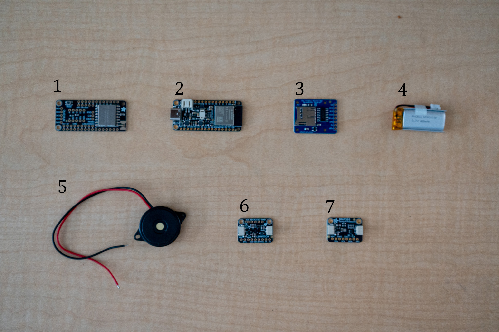

# CanSat Avionics & Telemetry System
 
A soda-can-sized flight computer that logs altitude and motion data, detects its own flight phases, and streams live telemetry to a laptop ground station over LoRa radio. It will fly as a payload in a BT-80 model rocket.
 
**Status:** In progress: bench testing (Fall 2026)
 

 
---
 
## Mission
 
Design, build, and recover a telemetry payload that logs atmospheric and inertial data and autonomously tracks its flight state from launch to touchdown.
 
**Primary objectives**
- [ ] Transmit live altitude, temperature, and battery voltage to a ground station at ≥ 1 Hz
- [ ] Detect flight states (pad → ascent → descent → landed) from live sensor data
- [ ] Log all flight data to an onboard microSD card as a backup to the radio link
**Secondary objectives**
- [ ] Auto-calibrate ground-level altitude on startup
- [ ] Record 6-axis IMU data during flight
- [ ] Sound a recovery buzzer after landing is confirmed
---
 
## Hardware
 
| # | Component | Role | Interface |
|---|---|---|---|
| 1 | RFM95W LoRa FeatherWing (915 MHz) | Telemetry radio | SPI |
| 2 | Adafruit ESP32-S3 Feather (8MB, no PSRAM) | Flight computer | — |
| 3 | MicroSD breakout | Onboard data logger | SPI |
| 4 | 400 mAh LiPo | Power | JST-PH |
| 5 | Piezo buzzer (passive) | Recovery beacon | GPIO |
| 6 | LSM6DSOX 6-DoF IMU | Acceleration, rotation rate | I2C (STEMMA QT) |
| 7 | BMP388 barometer | Altitude, temperature | I2C (STEMMA QT) |


 
The ground station is a second ESP32-S3 Feather + LoRa FeatherWing connected to a laptop over USB.
 
### Why these parts
<!-- One or two sentences each, in your own words, from the datasheets. -->
- **ESP32-S3:** Built-in wifi/bluetooth good for bench testing before adding the radio. Dual-core, allowing one core to handle sensor reading while the other handles radio transmission. Hardware floating-point unit (FPU) for fast and accurate sensor calculations. Also includes built-in LiPo battery connection and battery monitoring, along with native USB.
- **BMP388:** Simple pressure/temp sensor 
- **LSM6DSOX:** 6-axis accelerometer/gyroscope capable of reading acceleration up to +-16 G, which prevents the launch data from peaking. 
- **LoRa (915 MHz):** (placeholder)
<!-- HIDDEN UNTIL READY: remove this line and the closing arrow line below to show
### Pin map (planned)
| Signal | Feather pin |
|---|---|
| LoRa CS | 10 |
| LoRa RST | 11 |
| LoRa IRQ | 6 |
| SD CS | 5 |
| Buzzer | TBD |
| I2C sensors | STEMMA QT port |
---
## Software
Written in C++ with PlatformIO (Arduino framework).
```
firmware/          Flight computer code
ground_station/    Receiver code + Python dashboard
docs/              Build log, test reports, images
data/              Logged test and flight data
```
**Build and upload:** open `firmware/` in VS Code with the PlatformIO extension, then click Upload.
---
## Test results
| Date | Test | Result | Report |
|---|---|---|---|
| | | | |
---
## Build log
Progress photos and notes: [docs/build-log.md](docs/build-log.md)
-->
 
---
 
## Roadmap
 
- [x] Component selection
- [ ] Sensor bring-up (no soldering)
- [ ] Soldering + SD card logging
- [ ] LoRa radio link + ground station
- [ ] Flight state machine
- [ ] Ground tests (elevator / drop test / data replay)
- [ ] Payload sled CAD + OpenRocket simulation
- [ ] Rocket flight
