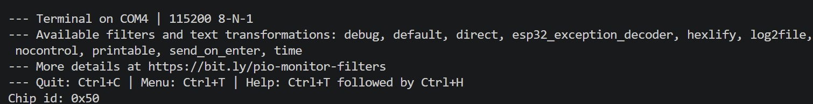

# Build Log

Newest entries at the top.

## 2026-10-03: Test 01 analysis, plotting script, LSM6DSOX bring-up

- Wrote the [Test 01 report](tests/01-elevator-altitude-test.md) and committed the
  exact firmware used for the test.
- Wrote `analysis/plot_elevator_test.py`: parses the Serial logs, recomputes altitude
  from raw pressure (applying the Run 2 reference correction), calculates the height
  change for each run, and saves the plot above.
- Connected the LSM6DSOX by daisy-chaining it off the BMP388's second STEMMA QT port
  (shared I2C bus: BMP388 at 0x77, LSM6DSOX at 0x6A).
- Configured ±16 g accelerometer and ±2000 °/s gyro ranges, and now read
  acceleration, rotation rate, and temperature alongside the barometer.
- Switched Serial output to one CSV line per reading with a `millis()` timestamp, and
  enabled PlatformIO's `time` and `log2file` monitor filters so every session is saved
  automatically.
- Result: <e.g. flat on desk: ax ≈ 0, ay ≈ 0, az ≈ 9.8 m/s²; gyro ≈ 0 at rest>

**Next:** IMU sanity checks (flip test), battery monitor, startup ground calibration,
then Test 02 (elevator test with barometer + accelerometer).

---

## 2026-10-02: Elevator altitude test (BMP388)

- Rode an elevator between the 1st and 14th floors while logging pressure and altitude.
- **Result:** Measured 38.3 m going down and 37.6 m going up (~38 m, ~2.9 m per floor);
  The two runs agree within 0.7 m. Elevator speed ≈ 1.6 m/s.
- **Problem:** Run 2 was logged with the wrong sea-level reference pressure.
  **Fix:** Recomputed altitude from the raw pressure readings. Height difference unaffected.
- After stopping, readings settled in ~18 s, with each reading closing ~25% of the
  remaining gap, matching IIR filter coefficient 3 updating once per 2 s reading.
- Pressure drift on the 1st floor was only ~0.3 m over 10 minutes.
- Full report: [Test 01](tests/01-elevator-altitude-test.md)

**Next:** Write up the report, plot the data, connect the LSM6DSOX IMU.

## 2026-10-01: First read from BMP388 chip ID with raw I2C

- Connected the BMP388 to the Feather over STEMMA QT (I2C).
- Researched the Arduino `Wire` (I2C) library and the BMP388 datasheet's
  register map before using any sensor-specific library, to understand
  what it does before using it.
- Wrote a raw I2C read of the CHIP_ID register (`0x00`) at the sensor's address (`0x77`).
- **Result:** read `0x50`, which matches the datasheet for the BMP388 sensor.

**Next:** Add the Adafruit BMP3XX library, then read temperature, pressure,
and altitude, and check that the values make sense.

---

## 2026-09-29: Toolchain setup + first upload

- Created a PlatformIO firmware project in VS Code (Adafruit Feather ESP32-S3 No PSRAM, Arduino framework)
- **Problem:** Upload failed with "Could not open COM3, port busy."

  **Fix:** Entered the bootloader manually (hold BOOT, tap RESET) for the
  first upload.
- Successful blink test on ESP32-S3 with serial output

**Next:** Connect and code I2C sensors for bench testing

---

## 2026-09-28: Parts arrived

- Received the Adafruit order: ESP32-S3 Feather, LoRa FeatherWing, BMP388, LSM6DSOX, microSD breakout, 400 mAh LiPo, buzzer.
- Found that I need a second Feather + radio for the ground station; ordered along with stacking headers, breadboard, and hookup wire.

**Next:** set up PlatformIO, blink the LED, read both sensors over STEMMA QT.

---

<!-- Template for each entry:

## YYYY-MM-DD: Short title

- What I did
- What went wrong and how I fixed it
- Numbers/results, if any

**Next:** what comes next

-->
