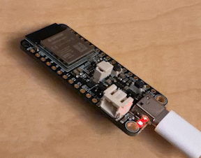
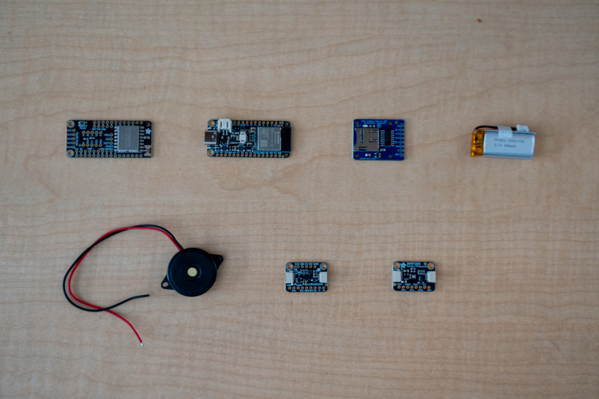

# Build Log

Newest entries at the top.

---

## 2026-09-29: Toolchain setup + first upload

- Created a PlatformIO firmware project in VS Code (Adafruit Feather ESP32-S3 No PSRAM, Arduino framework)
- **Problem:** Upload failed with "Could not open COM3, port busy."

  **Fix:** Entered the bootloader manually (hold BOOT, tap RESET) for the
  first upload.
- Successful blink test on ESP32-S3 with serial output

**Next:** Connect and code I2C sensors for bench testing

---

## 2026-09-28: Parts arrived

- Received the Adafruit order: ESP32-S3 Feather, LoRa FeatherWing, BMP388, LSM6DSOX, microSD breakout, 400 mAh LiPo, buzzer.
- Found that I need a second Feather + radio for the ground station; ordered along with stacking headers, breadboard, and hookup wire.

**Next:** set up PlatformIO, blink the LED, read both sensors over STEMMA QT.

---

<!-- Template for each entry:

## YYYY-MM-DD: Short title

- What I did
- What went wrong and how I fixed it
- Numbers/results, if any

**Next:** what comes next

-->
