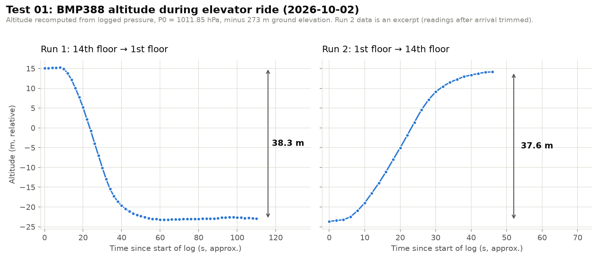

# Test 01: Barometric Altitude, Elevator Test

**Date:** 2026-10-02
**Hardware:** Adafruit ESP32-S3 Feather + BMP388 (STEMMA QT, I2C 0x77), powered over USB from a laptop

**Data:**
- [`data/2026-10-02_elevator-test_run1_full.txt`](../../data/2026-10-02_elevator-test_run1_full.txt): Run 1, complete Serial Monitor output (56 readings, including settling on arrival)
- [`data/2026-10-02_elevator-test_excerpt.txt`](../../data/2026-10-02_elevator-test_excerpt.txt): excerpt of both runs with run labels added and readings after arrival trimmed. **Run 2 is only available in this excerpt.**

---

## Objective

Verify that the BMP388 can measure a known height change by riding an elevator between the 1st and 14th floors (13 floors), and characterize how the readings settle and drift.

## Setup

| Setting | Value |
|---|---|
| Pressure oversampling | 8× |
| Temperature oversampling | 2× |
| IIR filter coefficient | 3 |
| Output data rate | 50 Hz |
| Print interval | ~2 s (`delay(2000)`) |
| Altitude formula | Adafruit `readAltitude(P0)` = 44330 × (1 − (P / P0)^0.1903), minus 273 m ground elevation (topo map) |
| Sea-level reference P0 | 1011.85 hPa (local weather report, 2026-10-02) |

## Procedure

1. Powered up on the 14th floor and let readings settle.
2. **Run 1:** Rode the elevator from the 14th floor down to the 1st and kept logging after arrival until readings settled.
3. Waited ~10 minutes on the 1st floor.
4. **Run 2:** Rode the elevator back up to the 14th floor, logging the whole time.

## Data correction

Run 2 was accidentally logged with P0 = 1013.25 hPa instead of 1011.85 hPa. The pressure readings were not affected (the reference only enters the altitude calculation), so Run 2 altitudes were **recomputed from the logged pressure** using P0 = 1011.85 hPa. This shifts every Run 2 altitude by a nearly constant −11.6 m and does **not** change the measured height difference. The logged values in the data files were not changed.

## Results

| | Run 1 (down) | Run 2 (up, corrected) |
|---|---|---|
| 14th floor | 977.76 hPa / 15.15 m (avg of 5 settled readings) | 977.88 hPa / 14.14 m (last reading in excerpt) |
| 1st floor | 982.24 hPa / −23.13 m (avg of first 10 settled readings) | 982.27 hPa / −23.44 m (avg of first 3 readings) |
| Pressure change | 4.48 hPa | 4.39 hPa |
| **Height change** | **38.3 m** | **37.6 m** |

- **Best estimate of height (1st → 14th floor): ~38 m**, i.e. **~2.9 m per floor**. The two runs agree within 0.7 m.
- **Expected:** <!-- fill in once the building's actual height or floor-to-floor height is known --> TBD. Typical floor-to-floor heights are ~2.9–3.1 m for residential buildings and ~3.5–4 m for offices.
- **Elevator speed:** largest change between readings was ~3.1–3.2 m per ~2 s interval, so **~1.6 m/s** (approximate; readings weren't timestamped).
- **Settling time after arrival (Run 1):** 9 readings (~18 s) to get within 0.1 m of the settled value.

## Analysis

1. **Height measurement:** The BMP388 tracked the full elevator ride in both directions, and the two runs agree within 0.7 m. Run 2's 14th-floor value may not have fully settled, so 37.6 m is slightly low.

2. **Settling matches the IIR filter model.** After Run 1 arrived, each new reading closed about **25% of the remaining gap** to the settled value (the remaining gap shrank by a factor of 0.72–0.78 per reading for the first four readings). That matches IIR filter coefficient 3, where each output is the previous output plus ¼ of the difference to the new measurement. 
3. **Pressure drift:** With both runs on the same reference, the 1st floor read −23.13 m after Run 1 and −23.44 m ten minutes later (**~0.3 m**). The 14th floor read 15.15 m at the start and 14.14 m at the end (**up to ~1 m**, partly because Run 2 hadn't fully settled). During the ~50 s of settled readings at the bottom of Run 1, altitude wandered between −23.26 and −22.52 m (~0.7 m) while the temperature rose 28.29 → 28.62 °C, likely from ventilation and/or sensor temperature changes. **For flight, the ground reference should be measured immediately before launch.**

4. **Temperature:** The 27.5–28.6 °C readings are the sensor chip's temperature, warmed by the board, laptop, and hand. They are not air temperature.

5. **Absolute altitude offset:** neither floor read near 0 m, because P0 came from a distant weather station and the ground elevation from a topo map. This doesn't affect relative measurements.

## Lessons/changes for next test

- **Save the complete, unedited log** to a file. Leave the data unedited.
- Log in **CSV format with timestamps** for exact timing and easy plotting
- Use a **single fixed reference**: zero altitude by averaging pressure at startup (pad calibration)
- Always log **raw pressure** alongside altitude so altitude can be recomputed later
- Find the building's actual height for a true accuracy comparison
- Repeat as **Test 02** after connecting the LSM6DSOX, logging barometer and accelerometer together
